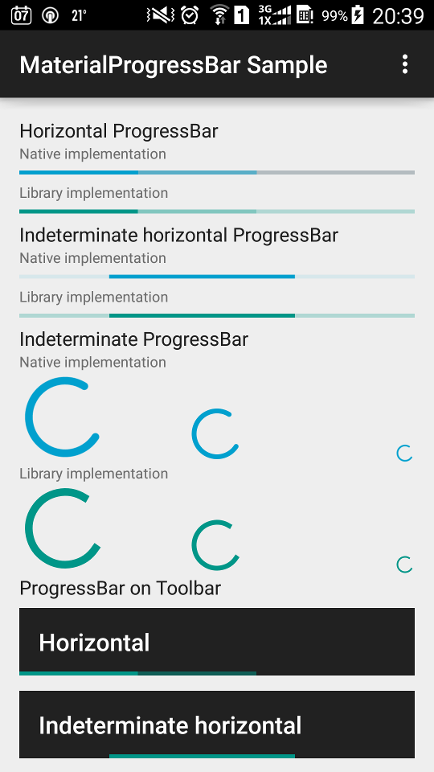
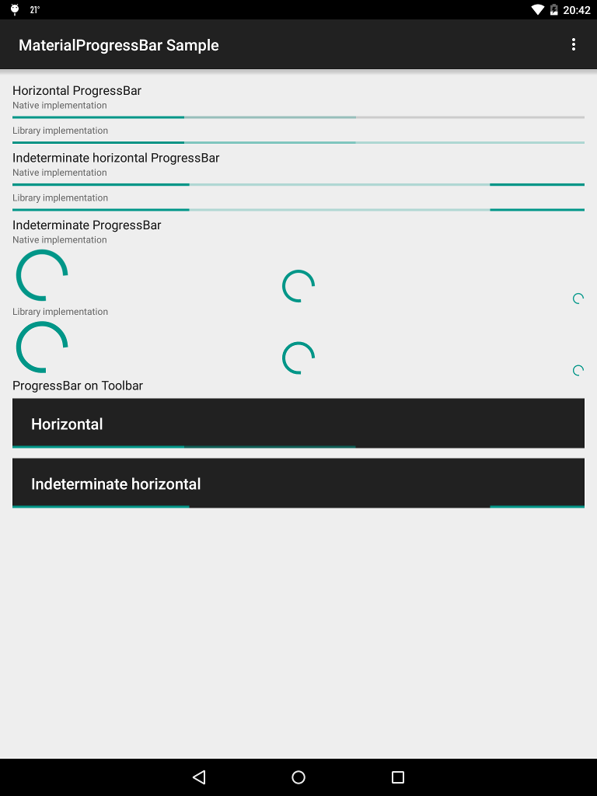

# MaterialProgressBar


Material design ProgressBar with consistent appearance on Android 4.0+.

## Screenshot

Android 4.4.4


Samsung Android 5.0.1 (native implementation fails to tint)



Android 5.1.1



[Sample application APK](dist/sample.apk)

## Integration

Gradle:

```gradle
compile 'me.zhanghai.android.materialprogressbar:library:1.0.2'
```

## Usage

Three material design `Drawable`s are backported to Android 4.0 (API 14), so you can create one and set it directly on your `ProgressBar`.

- [`HorizontalProgressDrawable`](library/src/main/java/me/zhanghai/android/materialprogressbar/HorizontalProgressDrawable.java)
- [`IndeterminateHorizontalProgressDrawable`](library/src/main/java/me/zhanghai/android/materialprogressbar/IndeterminateHorizontalProgressDrawable.java)
- [`IndeterminateProgressDrawable`](library/src/main/java/me/zhanghai/android/materialprogressbar/IndeterminateProgressDrawable.java)

For example, to set a `HorizontalIndeterminateProgressDrawable` on a `ProgressBar`.

```java
progressBar.setIndeterminateDrawable(new HorizontalIndeterminateProgressDrawable(this));
```

In order to make your `ProgressBar` take the correct and consistent size on all versions, you need to use one of the styles this library provided. The trick inside it is `android:minHeight`, `android:maxHeight` (and width) that controls the `Drawable` size.

- `Widget.MaterialProgressBar.ProgressBar.Horizontal`
- `Widget.MaterialProgressBar.ProgressBar`
- And more size and no-padding variants in [styles.xml](library/src/main/res/values/styles.xml)

For example, to define an indeterminate horizontal `ProgressBar`.

```xml
<ProgressBar
            android:id="@+id/indeterminate_horizontal_progress"
            android:layout_width="match_parent"
            android:layout_height="wrap_content"
            android:indeterminate="true"
            style="@style/Widget.MaterialProgressBar.ProgressBar.Horizontal" />
```

Don't forget to create and set the `Drawable` as above.

You can also customize the behavior of these `Drawable`s by calling `setShowTrack()` and `setUseIntrinsicPadding()`. Tint-related methods `setTint()`, `setTintList()` and `setTintMode()` are also backported so that you can use them directly.

For a detailed example, you can refer to the `onCreate()` method of the sample's [`MainActivity`](sample/src/main/java/me/zhanghai/android/materialprogressbar/sample/MainActivity.java) and its layout [main_activity.xml](sample/src/main/res/layout/main_activity.xml).

## ProGuard

If you are using ProGuard, you need to add the following line to your ProGuard configuration file, so that `ObjectAnimator` can work properly.

```
-keep class me.zhanghai.android.materialprogressbar.** { *; }
```

## Older versions

Neither Support v4 nor AppCompat v7 backported animation API to versions prior to ICS, and the [NineOldAndroids](https://github.com/JakeWharton/NineOldAndroids/) library has already been deprecated since people should all be using `minSdkVersion="14"` now, so versions older than ICS are not supported.

## License

    Copyright 2015 Zhang Hai

    Licensed under the Apache License, Version 2.0 (the "License");
    you may not use this file except in compliance with the License.
    You may obtain a copy of the License at

       http://www.apache.org/licenses/LICENSE-2.0

    Unless required by applicable law or agreed to in writing, software
    distributed under the License is distributed on an "AS IS" BASIS,
    WITHOUT WARRANTIES OR CONDITIONS OF ANY KIND, either express or implied.
    See the License for the specific language governing permissions and
    limitations under the License.
